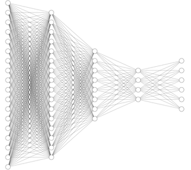

# Intro
Hi, I am Max, third-year CS student. My interest is to think about **human mind and AI**.

## Some fun facts about computer science
> Computer Science is no more about computers than astronomy is about telescopes. — EdsgerDijkstra, 1970

```python
print("Hello World!") 
```

# More About Me
[My favorite video](https://www.youtube.com/watch?v=dQw4w9WgXcQ&ab_channel=RickAstley), probably...
I like [CS](#Intro) because it satisfies my curiosity!

# More?
- Like to go to gym! 💪
- Mindfulness 🧘🏼‍♂️
- Of course, studying 💯
  - Let's go

# I wish to ...
- [x] Take care of myself
- [x] Retain my freedom stemming from first principle
- [ ] Surrender to tenets untested by critical thought

